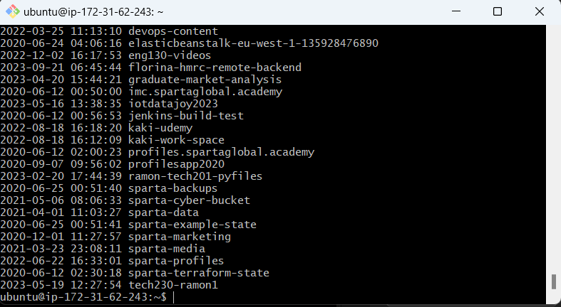

### S3 buckets - AWS
 
1. Search for **S3** on Amazon service search 
2. Click on **Buckets** on the left hand side menu
3. In a new tab open **EC2** instance. NOTE: Ensure the security group has port range 22
4. Open Gitbash terminal and connect to instance made
5. `sudo apt update`
6. `sudo apt upgrade -y`
7. `sudo apt install python -y` to install python
8. `sudo apt install python-pip -y` - to install pip
9. `sudo pip install awscli`
10. `aws configure`
    11. Message: AWS Access key ID:
12. Enter the access key and secret key when prompted
    13. Message: Default region name [None]: `eu-west-1`
15. Message: Default output format [None]: `json`
NOTE: background variables are not set
16. To check you are linked up, run command `aws s3 ls`
NOTE: You should get a list of all the buckets as shown below and match up to the list of buckets on **AWS Buckets page**

## Create bucket
1. `aws s3 mb s3://tech254-lukef-bucket --region eu-west-1` - make a bucket in the directory stated and region stated
NOTE: mb - make bucket

## Upload file
1. create example file `sudo nano example.txt`
2. Put some text in and same
3. Ensure the file is there with `ls`
4. `aws s3 cp example.txt s3://tech254-wafa-bucket` - save to the specific place
5. Check the AWS buckets Page and it should be in your folder

## Read
1. `aws s3 sync s3://tech254-wafa-bucket s3_downlaods`
2. Do `ls` to see if the folder has been downloaded

## Delete 
1. `aws s3 rm s3://tech254-wafa-bucket/example.txt` - add the file you want to delete at the end
2. rb - remove bucket. `aws s3 rb s3://tech254-wafa-bucket`

